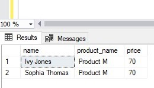

# TINY SHOP SALES ANALYSIS USING SQL
#### Overview
This case study uses PostgreSQL. To successfully answer all the questions you should have been exposed to the following areas of SQL:
* Basic aggregations
* CASE WHEN statements
* Window Functions
* Joins
* Date time functions
* CTEs
#### Data source
[Tiny shop](Tiny_shop_database.sql)

#### Recommended Analysis
1. Which product has the highest price? Only return a single row.
2. Which customer has made the most orders?
3. What’s the total revenue per product?
4. Find the day with the highest revenue
5. Find the first order (by date) for each customer.
6. Find the top 3 customers who have ordered the most distinct products
7. Which product has been bought the least in terms of quantity?
8. What is the median order total?
9. For each order, determine if it was ‘Expensive’ (total over 300), ‘Affordable’ (total over 100), or ‘Cheap’.
10. Find customers who have ordered the product with the highest price.

**Codes**
1. Which product has the highest price? Only return a single row.
```SQL
-- selecting the first product name and price
SELECT TOP (1) product_name, price
FROM products
-- ordering the price of products in descending order
ORDER BY price DESC
```

---

2. Which customer has made the most orders?
```SQL
SELECT	first_name, 
		last_name,
        --creating a correlated subquery that returns a scalar of total number of orders
		(SELECT COUNT (order_id)
		FROM orders 
		WHERE orders.customer_id = customers.customer_id)  AS number_of_orders
FROM customers
-- ordering the results in descending order
ORDER BY number_of_orders DESC
```

---
3. What’s the total revenue per product?
```SQL
-- selecting product names and calculating sum of revenue from a subquery
SELECT	product_name,
		sum(total_sale) as revenue
FROM
	( -- A subquery that returns a table of total prices each order quantity has	
		SELECT  product_name,
				quantity,price, 
				(price * quantity) AS total_sale
		FROM order_items AS o
		-- left joining products table to get the product names and their prices
		LEFT JOIN products AS p 
			ON o.product_id = p.product_id
	)m
-- grouping sum of revenue by product names
GROUP BY product_name
```

---
4. Find the day with the highest revenue
```SQL
-- selecting first order date and calculating sum of revenue from subquery
SELECT TOP (1) order_date, SUM(total_price) AS revenue
FROM
	(-- selecting order date and calculating total price of each product quantity
	 SELECT order_date,
			quantity,
			price, 
			(price * quantity) AS total_price 
	 FROM order_items AS o
	 --left joining with products to get product prices
	 LEFT JOIN products AS p
		ON o.product_id = p.product_id
	-- left joining with orders to get order date
	 LEFT JOIN orders 
		ON o.order_id = orders.order_id
	)m
-- grouping sum of revenue by order date
GROUP BY order_date
--ordering the results by revenue in descending order
ORDER BY revenue DESC
```

---
5. Find the first order (by date) for each customer.
```SQL
--selecting customer ID, order date and order ID from subquery
SELECT  customer_id, 
		order_date, 
		order_id
FROM 
	(-- assigning row numbers over orders table and partitioning by customer ID and ordering by date in each partition
	 SELECT customer_id, 
			order_date, 
			order_id, 
			ROW_NUMBER() OVER(PARTITION BY customer_id ORDER BY order_date) AS row_num
	 FROM orders
	) AS sub
--filtering rows assigned number 1 as first order day 
WHERE row_num = 1
```

---
6. Find the top 3 customers who have ordered the most distinct products
```SQL
-- selcting top 3 customer names with distinct number of number of products 
SELECT TOP 3 name, 
		COUNT(DISTINCT product_name) AS number_of_products
FROM 
	(-- selecting customer names and product names
		SELECT (first_name+' '+last_name) AS name, 
				product_name
		FROM order_items AS o
			-- left joining products table to get product name
			LEFT JOIN  products AS p
				ON o.product_id = p.product_id
			-- left joining orders table to get customer ID column 
			LEFT JOIN orders
				ON o.order_id = orders.order_id
			--left joining customers table to get customer names
			LEFT JOIN customers AS c
				ON orders.customer_id = c.customer_id
	) AS product
-- grouping the results by customer name
GROUP BY name
-- ordering the results in descending order
ORDER BY number_of_products DESC
```

---
7. Which product has been bought the least in terms of quantity?
```SQL
-- selecting product names and sum of quantity
SELECT	p.product_name,
		SUM(o.quantity) AS total_quantity
FROM order_items AS o
		--left joining products to get product names
	LEFT JOIN  products AS p
		ON o.product_id = p.product_id
--grouping by product name to get total quantity of each product
GROUP BY p.product_name
--ordering the results by total quantity bought
ORDER BY total_quantity ASC
```

---
8. What is the median order total?
```SQL
--selecting total order from subquery
SELECT total_orders
FROM	
	(SELECT  customer_id,
			--counting total number of orders for each customer
			COUNT (customer_id) OVER(PARTITION BY customer_id) AS total_orders,
			--assigning row numbers and ordering in ascending order by customer ID
			ROW_NUMBER() OVER(ORDER BY customer_id) AS row_num,
			--total number of observations (n)
			COUNT (*) OVER () AS totalrows
	FROM orders
	) AS subquery
--filtering the results to return median value
WHERE row_num IN (totalrows/2,(totalrows + 1)/2)
```

---
9. For each order, determine if it was ‘Expensive’ (total over 300), ‘Affordable’ (total over 100), or ‘Cheap’.
```SQL
--creating a common table expression that returns total price of each order quantity
WITH revenue AS 
	(	SELECT order_id, 
				quantity, price,
				(quantity * price) AS revenue
		FROM order_items AS o
			LEFT JOIN  products AS p
				ON o.product_id = p.product_id
	) 
-- selecting order ID and summing revenue for each order from CTE 
SELECT	order_id, 
		SUM(revenue) AS total_revenue, 
		-- categorising total revenue
		CASE WHEN SUM(revenue) > 300 THEN 'expensive'
		WHEN SUM(revenue) > 100 THEN 'affordable'
		ELSE 'cheap' END AS order_value
FROM revenue
-- grouping sum of revenue by order ID
GROUP BY order_id
```

---
10. Find customers who have ordered the product with the highest price.
```SQL
--selecting customer names, product name and price from customer table and products table
SELECT  (first_name+' '+last_name) AS name,product_name,price
FROM order_items AS o
	--left joining products table to get price and product name
	LEFT JOIN  products AS p
		ON o.product_id = p.product_id
	--left joining orders to get customer ID column
	LEFT JOIN orders
		ON o.order_id = orders.order_id
	--left joining customers table to get customet names
	LEFT JOIN customers c
		ON orders.customer_id = c.customer_id
--filtering results to the product with high price
WHERE product_name = 'Product M'
```

---
